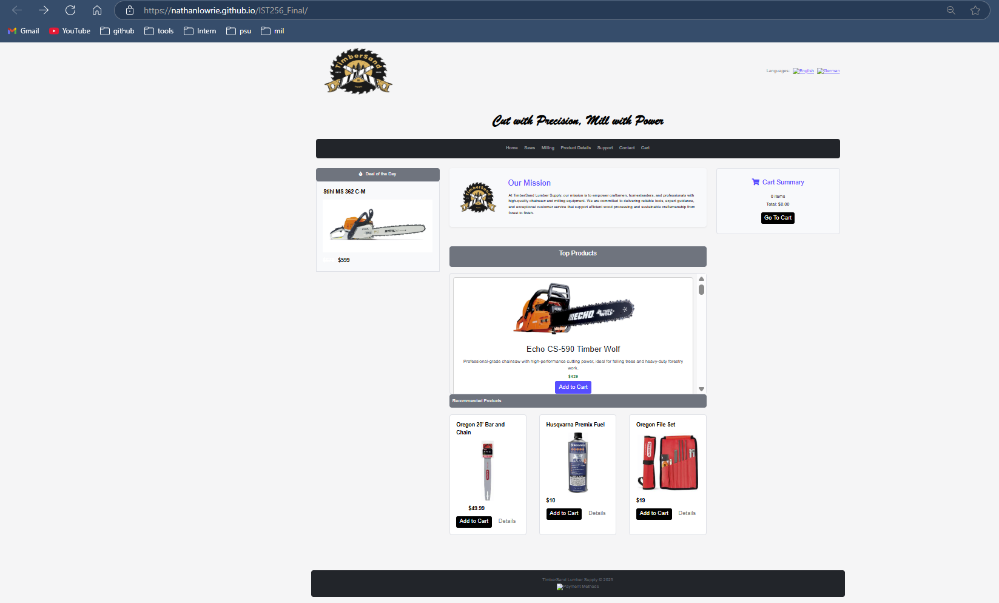

# IST256_Final

Nathan Lowrie

April 28th, 2025

Github Pages URL:

https://nathanlowrie.github.io/IST256_Final/

ScreenShot:

Changes:

-Changed the name of the company from The Tool-Shop to TimberSand Lumber Supply.
-Created and inserted a different logo image.
-Added tagline: 'Cut with Precision, Mill with Power'.
-Inserted a mission statement.
-Redesigned header using Bootstrap.
-Replaced the original nav menu with a Bootstrap navbar.
-Inserted 4 font awesome icons throughout the index.html and the chainsaws.html.
-Used Bootstrap to remake the products and how they were structured.
-grouped like buttons together to share their characteristics.
-Created product. JSON file with basic product information.
-Loaded the JSON file products into a “top products” section on the home page with fetch. Made it scrollable so it didn’t take up a lot of room and kept the page clean.
-Recreate a boxOver.js to manage the cart, form submissions, and product loading.
-Created contact and support forms to show our customers how much we value their feedback or concerns. 
-Rebuilt 95% of the styles.css to match the HTML and the overall goal of the website.
-Added hover effects on most products and their features. 
-Reformatted the site from an older style of HTML to HTML5 with Bootstrap integration.
-Reworked and replaced older CSS with Bootstrap.
-Replaced HTML table layouts with Bootstrap grid.
-Created a client-side cart for products with local Storage in JavaScript.
-Used pop-ups to give feedback when customers interacted with the site.
-Included all new images for the site and referenced them correctly. 
-Replaced outdated HTML, CSS, and JavaScript code and functions.
-Used different bootstrap classes to clean up the HTML layout.
-Rebuilt all the pages to use the same styling template.

Template url // template content is posted in template/tool-shop

https://www.free-css.com/free-css-templates/page88/tool-shop

